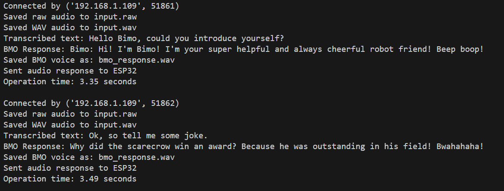
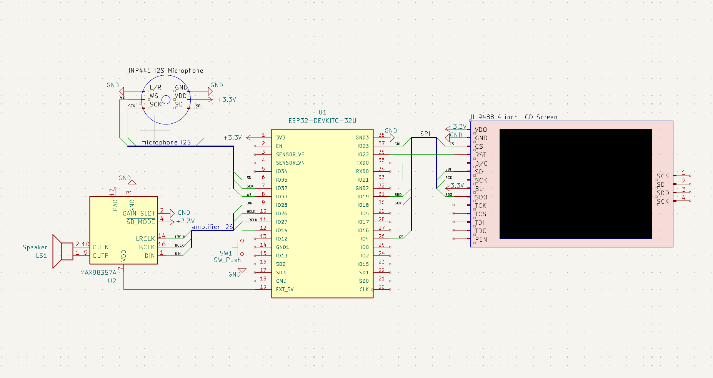
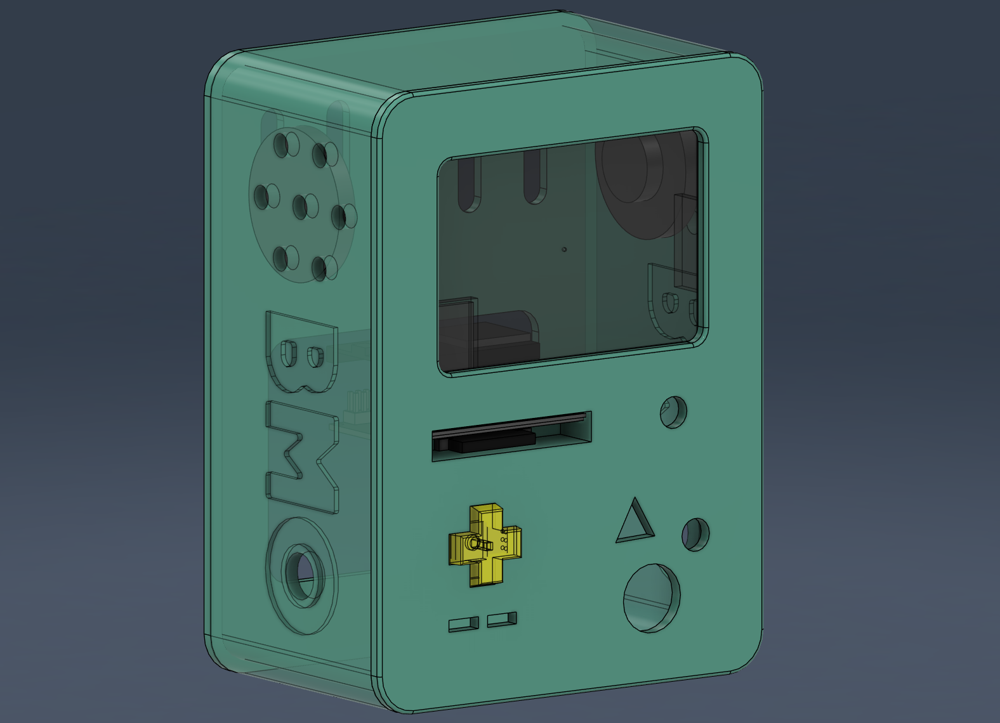
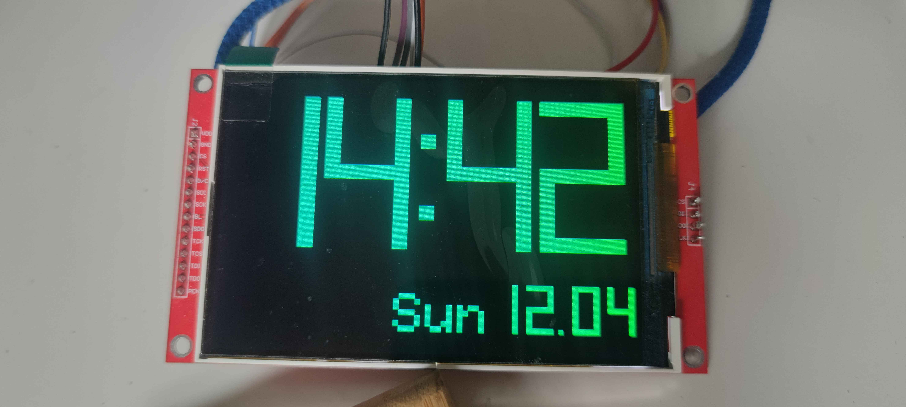

# BMO Voice Assistant (ESP32 + OpenAI)

Embedded AI voice assistant inspired by BMO (*Adventure Time animated series*), built with ESP32 and a custom Python backend.  
The system enables real-time voice interaction using speech recognition, LLM responses, and audio synthesis.

---

##  Demo
Example conversation – Python server console output
<p align="center">
  
</p>

Recorded video of that conversation: https://youtu.be/fuaXB3A9knM

---

##  Hardware

<p align="center">
  
</p>

---

##  Key Features

-  Real-time audio capture (ESP32 + I2S microphone)  
-  Wi-Fi streaming to Python server (TCP)  
-  Speech-to-text using OpenAI API  
-  AI responses with custom personality (BMO-style)  
-  Text-to-speech with audio post-processing  
-  Streaming audio response back to ESP32  
-  TFT display with custom BMO-inspired UI  
-  Silence detection and automatic recording stop  

---

##  Tech Stack

**Embedded:**
- ESP32 (C++ / Arduino)
- I2S (audio input/output)
- TFT_eSPI (display)

**Backend:**
- Python (socket server)
- NumPy / SciPy (audio processing)
- PyDub / SoundFile

**AI:**
- OpenAI API (STT + GPT + TTS)

---

##  System Flow

ESP32 → audio → Python Server → STT → GPT → TTS → effects → ESP32

---

## 📂 Repository Structure---
```
ESP32-Server-Based-Voice-Agent/
├── src/
│   ├── python-server/
│   │   ├── bmo_voice.py
│   │   ├── gpt.py
│   │   └── serverBMO.py
│   ├── esp32-record-response-agent/   
│   │   └── esp32-record-response-agent.ino
│   └── RTC-LCD-watch/
│       └── RTC-LCD-watch.ino
├── KiCad_files
├── images
└── README.md
```
---

##  Highlights

- End-to-end voice AI pipeline on embedded hardware  
- Custom real-time audio streaming over TCP  
- Working physical prototype (tested on development board)  
- Combines embedded systems, DSP, networking, and AI  

---

##  Future Work

- Custom BMO enclosure (in progress)

In addition to the previously mentioned functionalities, it will have an SD card reader, a lithium-ion battery charging module, and single- and multi-directional interaction buttons.

Preview of the design:
<p align="center">
  
</p>

- integrated RTC Watch (in progress)

This watch is syncroni

Preview of the design:
<p align="center">
  
</p>
  
- Wake-word detection  
- Lower latency streaming
